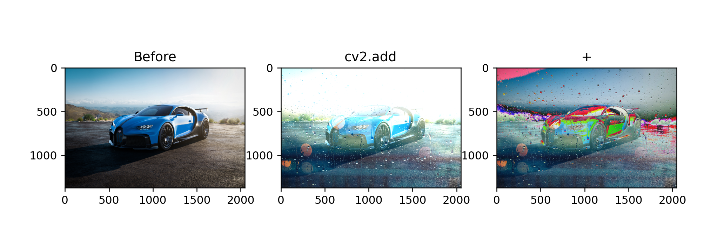
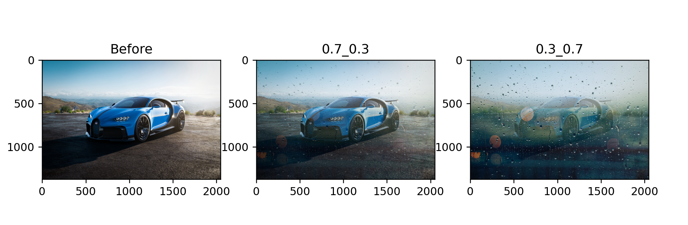
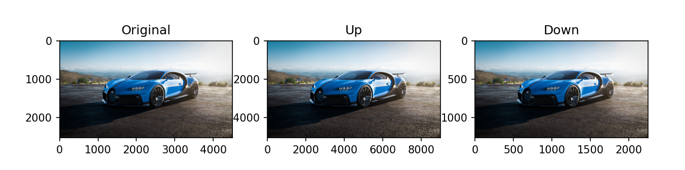
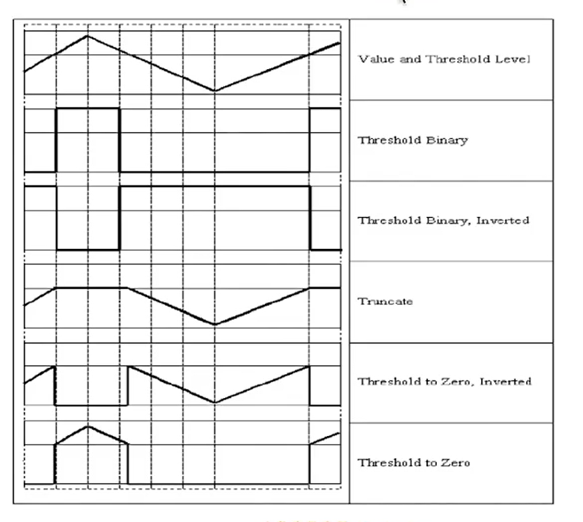
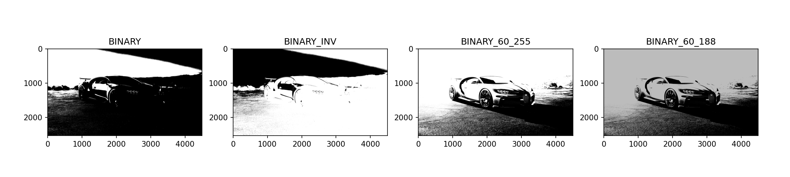
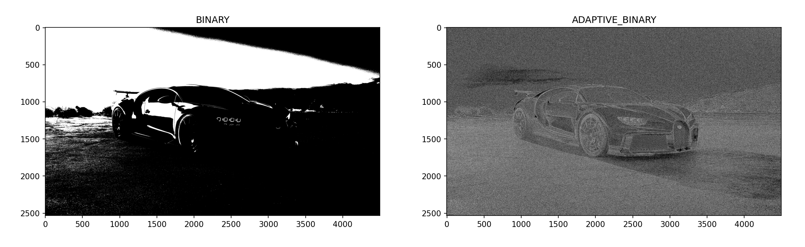
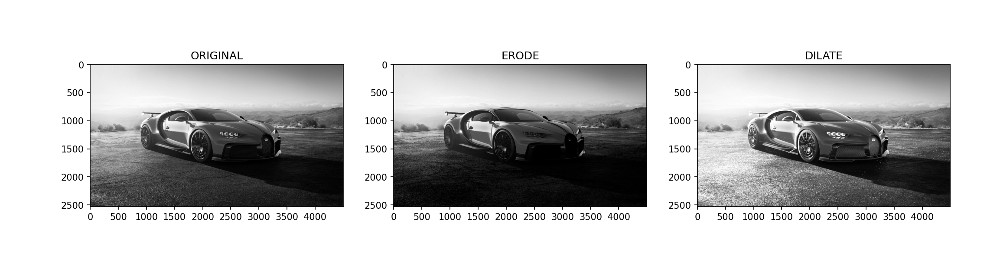

# **项目一：车辆数检测**


## **模块一：窗口展示与数据加载**
* 窗口展示
```
cv2.namedWindow("car", cv2.WINDOW_NORMAL)  # 设置窗口名称为car，并定义窗口大小
cv2.resizeWindow("car", (480, 640)) # 定义窗口大小为(480, 640)

# cv2.namedWindow("car", cv2.WINDOW_AUTOSIZE) cv2.WINDOW_AUTOSIZE表示自动切换窗口大小，可以不用resizeWindow方法

key = cv2.waitKey(0) # 定义显示延迟时间

if key & 0xFF == ord("q"): # 输入q键，即退出并释放所有资源
    cv2.destroyAllWindows()
```
* 图片加载
```
img = cv2.imread("/.car.jpg")
cv2.imshow(img)
```


&emsp;&emsp; 默认情况imread返回的是<font color = deepSkyBlue>*B</font><font color = DarkSeaGreen>G</font><font color = Crimson>R*</font>格式的图像
BGR格式是opencv中颜色默认表现形式(即蓝-绿-红);<font color="LightPink">采用uint8类型</font>

&emsp;&emsp;还可以指定imread的模式：

   * <font color=LightSkyBlue>cv2.IMREAD_COLOR:</font> 默认形式，提供三通道的BGR图像，每个通道8bit(0~255)
   * <font color=LightSkyBlue>cv2.IMREAD_GRAYSCALE:</font> 提供8位灰度图像
   * cv2.IMREAD_UNCHANGED：读取所有的图像数据，包括作为第四通道的α或透明度通道

&emsp;&emsp;补充一下色彩空间：

1. GRAY色彩空间

&emsp;&emsp;GRAY色彩空间通常指的是灰度图像，灰度图像是一种每个像素都是从黑到白，被处理为256个灰度级别的单色图像。这256个灰度级别分别用区间[0, 255]中的数值表示。其中，“0”表示纯黑色，“255”表示纯白色，0～255的数值表示不同亮度（即色彩的深浅程度）的深灰色或者浅灰色。因此，一幅灰度图像也能够展现丰富的细节信息。
```
img = cv2.imread("/.car.jpg")
cv2.cvtColor(img, cv2.COLOR_BGR2GRAY)
```


2. HSV色彩空间

&emsp;&emsp;HSV色彩空间是基于<font color=LightSkyBlue>色调、饱和度和亮度</font>而言的。其中，色调（H）是指光的颜色，例如，彩虹中的赤、橙、黄、绿、青、蓝、紫分别表示不同的色调，如下图所示。在OpenCV中，色调在区间[0, 180]内取值。例如，代表红色、黄色、绿色和蓝色的色调值分别为0、30、60和120。饱和度（S）是指色彩的深浅。在OpenCV中，饱和度在区间[0,255]内取值。当饱和度为0时，图像将变为灰度图像。亮度（V）是指光的明暗。与饱和度相同，在OpenCV中，亮度在区间[0, 255]内取值。亮度值越大，图像越亮；当亮度值为0时，图像呈纯黑色。

<div align=center>

</div>

```
img = cv2.imread("/.car.jpg")
cv2.cvtColor(img, cv2.COLOR_BGR2HSV)
```

&emsp;&emsp;下面是转换为HSV色彩空间的图：


3. HSL色彩空间

&emsp;&emsp;HLS也有三个分量，hue（色相）、saturation（饱和度）、lightness（亮度）。HLS 和 HSV 的区别就是最后一个分量不同，HLS的是light(亮度)，HSV 的是value(明度)。HLS 中的 L 分量为亮度，亮度为100，表示白色，亮度为0，表示黑色；HSV 中的 V 分量为明度，明度为100，表示光谱色，明度为0，表示黑色。
<div align=center>

</div>

```
img = cv2.imread("/.car.jpg")
cv2.cvtColor(img, cv2.COLOR_BGR2HSl)
```
* 色彩转换

&emsp;&emsp;OpenCV提供的cvtColor()方法不仅能将图像从BGR色彩空间转换到GRAY色彩空间，还能将图像从BGR色彩空间转换到HSV色彩空间。当图像在BGR色彩空间和HSV色彩空间之间转换时，常用的色彩空间转换码是cv2.COLOR_BGR2HSV和cv2.COLOR_HSV2BGR。

* 视频加载
```
cap = cv2.VideoCapture("/.video.mp4) # 文件名，获取视频文件的视频帧
fps = cap.get(cv2.CAP_PROP_FPS) # 29.97
size = (int(cap.get(cv2.CAP_PROP_FRAME_WIDTH)), int(cap.get(cv2.CAP_PROP_FRAME_HEIGHT)))  # (1280, 720)
ret， img = cap.read() # 其中，ret表示是否捕获成功，返回布尔类型。image返回捕获的帧信息（也就是图像）。如果没有捕获帧信息，该值为空
cv2.imshow("video", img)
key = cv2.waitKey(40)  
# 若要视频正常显示，满足： 1000 / waitKey值 <= 帧数 --> 1000 / 帧数 <= waitKey值   1000 / 29.97 = 33.3 < 40
cap.release() # 释放视频资源

"""
若读取的是摄像头输入的视频
cap = cv2.VideoCapture(0)
result=cv2.VideoCapture.isOpened() # 判断摄像头是否开启
if result is False: result=cv2.VideoCapture.open(0)
"""
```
* 视频写入

&emsp;&emsp;VideoWriter类的构造函数的参数值得特别注意。必须指定一个视频文件的名称。具有此名称的所有之前存在的文件都将被覆盖。还必须指定一个视频编解码格式(fourcc)。可用的编解码器因系统而异。支持的选项可能包括以下内容：
1. 0：这个选项表示未压缩的原始视频文件。文件扩展名应该是.avi
2. cv2.VideoWriter_fourcc('I','4','2','0')：这个选项表示未压缩的YUV编码，4:2:0色度抽样。这种编码是广泛兼容的，但是会产生大的文件。文件扩展名应该是.avi
3. cv2.VideoWriter_fourcc('P','I','M','1')：这个选项是MPEG-1。文件扩展名应该是.avi
4. cv2.VideoWriter_fourcc('X','V','I','D')：这个选项是一种相对较旧的MPEG-4编码。如果想限制生成的视频大小，这是一个不错的选项。文件扩展名应该是.avi
5. cv2.VideoWriter_fourcc('M','P','4','V')：这个选项是另一种相对较旧的MPEG-4编码。如果想限制生成的视频大小，这是一个不错的选项。文件扩展名应该是.mp4
6. cv2.VideoWriter_fourcc('X','2','6','4')：这个选项是一种相对较新的MPEG-4编码。如果想限制生成的视频大小，这可能是最佳的选项。文件扩展名应该是.mp4
```
""" 
    VideoWriter:
        文件路径;
        文件编码格式(fourcc);
        帧率(fps);
        分辨率(如是读取摄像头，必须符合摄像头的分辨率）
"""
fourcc = cv2.VideoWriter_fourcc('M', 'P', '4', 'V') 
# 也可以写成 fourcc = cv2.VideoWriter_fourcc(*”MP4V") 
vm = cv2.VideoWriter("./video", fourcc, 29, (1280, 720))
```
---
## **模块二：图形与文字绘制**
* 图形绘制
    * 线段绘制： ```img = cv2.line(img, pt1, pt2, color, thickness) # pt1: 起点坐标；pt2: 终点坐标；thickness：线宽(-1表示填充)```
    * 矩形绘制: ```img = cv2.rectangle(img, pt1, pt2, color, thickness) # pt1: 矩形左上角坐标；pt2: 矩形右下角坐标```
    * 圆形绘制: ```img = cv2.circle(img, center, radius, color, thickness) # center: 圆心坐标；radius: 圆形半径```
    * 多边形绘制：```img = cv2.polylines(img, pts, isClosed, color, thickness) # pts：由多边形各个顶点的坐标组成的一个列表，这个列表是一个numpy的数组类型；isClosed：如果值为True，表示一个闭合的多边形；如果值为False，表示一个不闭合的多边形```
* 文字绘制： ```img = cv2.putText(img, text, org, fontFace, fontScale,color, thickness, lineType, bottomLeftOrigin) # org: 文字在画布中的左下角坐标；fontFace：字体样式；fontScale：字体大小```

<font color = orange>Opencv中的颜色值是一个列表类型！！</font>
```
import cv2

cv2.namedWindow("car_mod", cv2.WINDOW_NORMAL)
cv2.resizeWindow("car_mod", (1125, 633))
img = cv2.imread("img/car.jpg")
cv2.rectangle(img, (1125, 633), (3375, 1899), (0, 0, 255), 3)
cv2.putText(img, "This is a car!", (1125, 1899), fontFace=cv2.FONT_HERSHEY_SIMPLEX,
            fontScale=5, color=(0, 0, 255), thickness=5)
while True:
    cv2.imshow("car_mod", img)
    cv2.imwrite("img/car_mod.jpg", img)
    key = cv2.waitKey(0)
    if key == ord("q"):
        break
```


---

## **模块三：图像的算数操作**

* 图像相加
可以使用Opencv中的cv2.add函数相加，也可通过Numpy操作直接相加，<font color="LightBlue">但Opencv采用的是加法是饱和操作，而Numpy是模操作</font>

  ```
    import cv2
    import numpy as np
    
    x = np.uint8([250])  # 注意add操作必要保证是向量，而不是标量
    y = np.uint8([10])
    print(cv2.add(x, y))  # 250+10=260 > 255 ————>255
    print(x+y)   # 260 % 256 = 4
  ```
  因此不同的操作计算的结果图也会不同。

  ```
  import cv2
  import numpy as np
  import matplotlib.pyplot as plt
  
  img1 = cv2.imread(r"D:\Opencv\Project1\Vehicles_Detection\img\car.jpg")
  img2 = cv2.imread(r"D:\Opencv\Project1\Vehicles_Detection\img\rain.jpg")
  img1 = cv2.resize(img1, dsize=(2048, 1371), interpolation=cv2.INTER_LINEAR)
  
  img3 = cv2.add(img1, img2)
  img4 = img1 + img2
  
  fig, axes = plt.subplots(nrows=1, ncols=3, figsize=(10, 8), dpi=100)
  axes[0].imshow(img1[:, :, ::-1])
  axes[0].set_title("Before")
  axes[1].imshow(img3[:, :, ::-1])
  axes[1].set_title("cv2.add")
  axes[2].imshow(img4[:, :, ::-1])
  axes[2].set_title("+")
  plt.show()
  
  ```


* 图像混合

```
  cv2.addWeighted(img1, w1, img2, w2, gamma)  # w1、w2表示不同图像的比例，gamma为常数项
```

  图像混合本质就是图像相加，只不过两幅图像的权重不同。
  ```
  import cv2
  import numpy as np
  import matplotlib.pyplot as plt
  
  img1 = cv2.imread(r"D:\Opencv\Project1\Vehicles_Detection\img\car.jpg")
  img2 = cv2.imread(r"D:\Opencv\Project1\Vehicles_Detection\img\rain.jpg")
  img1 = cv2.resize(img1, dsize=(2048, 1371), interpolation=cv2.INTER_LINEAR)
  
  img3 = cv2.addWeighted(img1, 0.7, img2, 0.3, 0)
  img4 = cv2.addWeighted(img1, 0.3, img2, 0.7, 0)
  
  fig, axes = plt.subplots(nrows=1, ncols=3, figsize=(10, 8), dpi=150)
  axes[0].imshow(img1[:, :, ::-1])
  axes[0].set_title("Before")
  axes[1].imshow(img3[:, :, ::-1])
  axes[1].set_title("0.7_0.3")
  axes[2].imshow(img4[:, :, ::-1])
  axes[2].set_title("0.3_0.7")
  plt.show()
  ```
  下图分别是原始图；比例为0.7-0.3;比例0.3-0.7


---
## **模块四：图像的几何变换**
* 缩放：
```
dst = cv2.resize(img, dsize, fx, fy, interpolation)
    '''
    dsize：输出图像的大小，格式为（宽，高），单位为像素；
    fx、fy: 水平、垂直方向的缩放比例(可选参数，在无确定dsize下使用)；
    interpolation：可选参数。缩放的插值方式。在图像缩小或放大时需要删减或补充像素，该参数可以指定使用哪种算法对像素进行增减。
    dst: 缩放后的图像
    interpolation:插值算法：
        cv2.INTER_NEAREST:最临近插值，速度快，效果差
        cv2.INTER_LINEAR:双线性插值，原图的四个点(默认)
        cv2.INTER_CUBIC:双三次插值，原图中的16个点
        cv2.INTER_AREA:像素区域重采样，效果最好,但最慢
    '''
```


```
import cv2

cv2.namedWindow("car_resize", cv2.WINDOW_NORMAL)
cv2.resizeWindow("car_resize", (1125, 633)) # 此处只改变窗口展示大小，并不改变图片实际大小

img = cv2.imread("img/car.jpg")
print(img.shape)  # (2532, 4500, 3)
dst = cv2.resize(img, (1125, 633), interpolation=cv2.INTER_LINEAR) # 此处图片大小改变
# dst = cv2.resize(img, 0.5, 0.5, interpolation=cv2.INTER_LINEAR)

while True:
    cv2.imshow("car_resize", dst)
    cv2.imwrite("img/car_resize.jpg", dst)
    print(dst.shape)  # (633, 1125, 3)
    key = cv2.waitKey(0)
    if key == ord("q"):
        break
```
* 翻转
```
dst = cv2.flip(img, flipcode)
  """
  flipcode:
    0: 沿x轴(水平方向)翻转
    正数(1): 沿y轴(竖直方向)翻转
    负数(-1): 同时沿x轴、y轴翻转
  """
```


```
import cv2

cv2.namedWindow("car_flip", cv2.WINDOW_NORMAL)
cv2.resizeWindow("car_flip", (1125, 633))

img = cv2.imread("img/car.jpg")
dst_0 = cv2.flip(img, 0)


while True:
    cv2.imshow("car_flip", dst_0)
    cv2.imwrite("img/car_flip.jpg", dst_0)
    key = cv2.waitKey(0)
    if key == ord("q"):
        break
```
* 透视(投影)：透视就是让图像在三维空间中变形。从不同的角度观察物体，会看到不同的变形画面
```
dst = cv2.warpPerspecctive(img, M, dsize, flags, borderMode, borderValue)
"""
  M: 一个3行3列的矩阵，根据此矩阵的值变换原图中的像素位置
    warpPerspective()方法也需要通过M矩阵计算透视效果，但得出这个矩阵需要做很复杂的运算，OpenCV提供了getPerspectiveTransform()方法自动计算M矩阵。
    M = cv2.getPerspectiveTransform(src, dst)
      src：原图4个点坐标，格式为4行2列的32位浮点数列表
      dst: 透视图的对应点坐标(格式与src一致)
  dsize: 输出图像的尺寸大小
  flags：插值方式，默认值即可
  borderMode、borderValue：默认即可
"""
```


```
import cv2
import numpy as np

cv2.namedWindow("car_warp", cv2.WINDOW_NORMAL)
cv2.resizeWindow("car_warp", (1125, 633))

img = cv2.imread("img/car.jpg")
src = np.float32([[200, 1500], [4000, 1500], [0, 800], [2500, 700]])
dst = np.float32([[0, 0], [2300, 0], [0, 2100], [2300, 2100]])
M = cv2.getPerspectiveTransform(src, dst)
new = cv2.warpPerspective(img, M, (2300, 2100))

while True:
    cv2.imshow("car_wap", new)
    cv2.imwrite("img/car_warp.jpg", new)
    key = cv2.waitKey(0)
    if key == ord("q"):
        break
```
* 仿射变换:仿射变换是一种仅在二维平面中发生的几何变形，变换之后的图像仍然可以保持直线的“平直性”和“平行性”，也就是原来的直线变换之后还是直线，平行线变换之后还是平行线
  ```
  dst = cv2.warpAffine(src, M, dsize, flags, borderMode, borderValue)
  
  """
  M：一个2行3列的矩阵，根据此矩阵的值变换原图中的像素位置
  """
  
  图像做何种仿射变换，完全取决于M的值，仿射变换输出的图像按照以下公式进行计算
  M = [[a, b, c],[d, e, f]]
  新x = 原x × a + 原y × b + c
  新y = 原x × d + 原y × e + f
  ```
  * 平移: ```M = [[1, 0, x偏移量] [0, 1, y偏移量]]```

  * 旋转：

    ``` 
    M = cv2.getRotationMaxtrix2d(center, angle, scale)
      """
      center: 旋转中心坐标
      angle：旋转的角度（不是弧度）。正数表示逆时针旋转，负数表示顺时针旋转
      scale：缩放比例，浮点类型。如果取值1，表示图像保持原来的比例
      """
    ```
  * 倾斜
      ``` 
      M = cv2.getAffineTransform(src, dst)
      """
      src：原图3个点坐标，格式为3行2列的32位浮点数列表
      dst：倾斜图像的3个点坐标，格式与src一样
      """


```
import cv2
import numpy as np

cv2.namedWindow("car_affine", cv2.WINDOW_NORMAL)
cv2.resizeWindow("car_affine", (1125, 633))

img = cv2.imread("img/car.jpg")
move = cv2.warpAffine(img, np.float32([[1, 0, 10], [0, 1, 20]]), (1125, 633))  # 平移
M_rotate = cv2.getRotationMatrix2D((1125, 633), 10, 1)
rotate = cv2.warpAffine(move, M_rotate, (1125, 633))  # 旋转
M_incline = cv2.getAffineTransform(src=np.float32([[0, 0], [1125, 0], [0, 633]]), dst=np.float32([[10, 0], [1135, 0], [0, 633]]))  # 倾斜
affine_all = cv2.warpAffine(rotate, M_incline, (1125, 633))

while True:
    cv2.imshow("car_affine", affine_all)
    cv2.imwrite("img/car_affine.jpg", affine_all)
    key = cv2.waitKey(0)
    if key == ord("q"):
        break
```

<font color = orange>点坐标类型必须是float32位！！！</font>
* 图像金字塔

&emsp;&emsp;图像金字塔是图像多尺度表达的一种，最主要用于图像的分割，是一种以多分辨来解是图像的有效但概念简单的结构。

&emsp;&emsp;<font color="LightPink">图像金字塔用于机器视觉和图像压缩，一副图像的金字塔是一系列以金字塔形状排列分辨率逐渐降低，且来源于同一张原始图的图像集合，其通过梯次向下采样获得，
直到达到某个终止条件才停止采样。</font>

&emsp;&emsp;金字塔的底部是待处理图像的高分辨率表示，而顶部是低分辨率的近似，层级越高，图像越小，分辨率越低。
  ```
  cv2.pyrUp(img)  # 图像上采样
  cv2.pyrDown(img)  # 图像下采样
  ```
下面分别是上采样和下采样后的图像，可以看出坐标不同。
```
import cv2
import numpy as np
import matplotlib.pyplot as plt

img = cv2.imread(r"D:\Opencv\Project1\Vehicles_Detection\img\car.jpg")
up_img = cv2.pyrUp(img)
down_img = cv2.pyrDown(img)
fig, axes = plt.subplots(nrows=1, ncols=3, figsize=(10, 8), dpi=100)
axes[0].imshow(img[:, :, ::-1])
axes[0].set_title("Original")
axes[1].imshow(up_img[:, :, ::-1])
axes[1].set_title("Up")
axes[2].imshow(down_img[:, :, ::-1])
axes[2].set_title("Down")
plt.show()
```


---
## **模块五、形态学**

&emsp;&emsp;形态学转换是基于图像形状的一些简单操作，其主要在二进制图像上执行，卷积核决定图像处理后的效果。
* 图像二值化：将图像的每个像素变成两种值：0，255
  * 全局二值化  
  ```
  cv2.threshold(img,thresh,maxVal,type)
      """
      img: 图像，最好是灰度图
      thresh：阈值
      maxVal: 超过阈值，替换为maxVal
      type: THRESH_BINARY: 二值化
            THRESH_BINARY_INV: 反二值化
            THRESH_TRUNC：削峰化
            THRESH_TOZER
            THRESH_TOZERO_INV
      return: 1. ret  执行结果
              2. img  图像
      """
  ```
  
  <div align=center>
  
  </div>

  ```
  import cv2
  import numpy as np
  import matplotlib.pyplot as plt
  
  img = cv2.imread(r"D:\Opencv\Project1\Vehicles_Detection\img\car.jpg")
  img1 = cv2.cvtColor(img, cv2.COLOR_BGR2GRAY)
  ret1, img2 = cv2.threshold(img1, 180, 255, cv2.THRESH_BINARY)  # 二值化
  ret2, img3 = cv2.threshold(img1, 180, 255, cv2.THRESH_BINARY_INV)  # 反二值化
  ret3, img4 = cv2.threshold(img1, 60, 255, cv2.THRESH_BINARY)  # 阈值改变1
  ret4, img5 = cv2.threshold(img1, 60, 188, cv2.THRESH_BINARY)  # 阈值改变2
  
  fig, axes = plt.subplots(nrows=1, ncols=4, figsize=(10, 8), dpi=100)
  axes[0].imshow(img2[:, ::-1], cmap="gray", vmin=0, vmax=255)
  axes[0].set_title("BINARY")
  axes[1].imshow(img3[:, ::-1], cmap="gray", vmin=0, vmax=255)
  axes[1].set_title("BINARY_INV")
  axes[2].imshow(img4[:, ::-1], cmap="gray", vmin=0, vmax=255)
  axes[2].set_title("BINARY_60_255")
  axes[3].imshow(img5[:, ::-1], cmap="gray", vmin=0, vmax=255)
  axes[3].set_title("BINARY_60_188")
  plt.show()
  ```
  
    * 自适应二值化：由于光照不均匀以及阴影存在，只有一个阈值会使得在阴影处的白色被二值化为黑色
    ```
    cv2.adaptiveThreshold(img,maxVal,adaptiveMethod,type,blockSize,C)
        blockSize：临近区域的大小
        C：常量，从计算出的平均值或加权平均值中减去
        type: 只包括二值化与反二值化
        adaptiveMethod：1.ADAPTIVE_THRESH_MEAN_C: 计算邻近区域的平均值
                        2.ADAPTIVE_THRESH_GAUSSIAN_C: 高斯窗口加权平均值
        return: 图像
    ```
    <font color="LightBlue">普通二值化有两个返回值，自适应二值化只有一个返回值</font>

    ```
  import cv2
  import numpy as np
  import matplotlib.pyplot as plt
  
  img = cv2.imread(r"D:\Opencv\Project1\Vehicles_Detection\img\car.jpg")
  img1 = cv2.cvtColor(img, cv2.COLOR_BGR2GRAY)
  ret1, img2 = cv2.threshold(img1, 180, 255, cv2.THRESH_BINARY)
  img3 = cv2.adaptiveThreshold(img1, 255, cv2.ADAPTIVE_THRESH_GAUSSIAN_C, cv2.THRESH_BINARY, 3, 0)
  
  fig, axes = plt.subplots(nrows=1, ncols=2, figsize=(10, 8), dpi=100)
  axes[0].imshow(img2[:, ::-1], cmap="gray", vmin=0, vmax=255)
  axes[0].set_title("BINARY")
  axes[1].imshow(img3[:, ::-1], cmap="gray", vmin=0, vmax=255)
  axes[1].set_title("ADAPTIVE_BINARY")
  plt.show()
    ```
    
    * 局部二值化
* 腐蚀: 原图中高亮的区域被蚕食，效果图拥有比原图更小的高亮区域，腐蚀是求局部最小值的操作

  <font color="LightBlue">具体操作是：用一个结构元素(自带一个核心，也叫做锚点,一般位于矩阵中央)扫描图像中的每一个像素，用结构元素中的每一个像素与其覆盖的像素做与运算，如果都为1，则像素为1；反之则为0</font>

  <font color="LightPink">腐蚀的作用是消除物体边界点，使目标缩小，消除图像的背景部分，也可以产生滤波器的效果</font>
  
  ```cv2.erode(img,kernel,iterations=1)```
* 膨胀：原图中的高亮部分扩张，效果图拥有比原图更大的高亮区域，膨胀是求局部最大值的操作

  <font color="LightBlue">具体操作是：用一个结构元素(自带一个核心，也叫做锚点,一般位于矩阵中央)扫描图像中的每一个像素，用结构元素中的每一个像素与其覆盖的像素做与运算，如果都为0，则像素为0；反之则为1</font>

  <font color="LightPink">可以用来填补目标区域中某些空洞以及消除包含在目标区域中的小颗粒噪声。</font>

  ```cv2.dilate(img,kernel,iterations=1)```

    * 卷积核的获取
      ```
      kernel = cv2.getStructuringElement(type,size)
      size: (3,3) 、(5,5)......
      type: 1.MORPH_RECT ————>矩形
            2.MORPH_ELLIPSE ————>椭圆形
            3.MORPH_CROSS ————> 十字形
      ```

  参考：https://blog.csdn.net/Chaolei3/article/details/79618602

  ```
  import cv2
  import numpy as np
  import matplotlib.pyplot as plt
  
  img = cv2.imread(r"D:\Opencv\Project1\Vehicles_Detection\img\car.jpg")
  img1 = cv2.cvtColor(img, cv2.COLOR_BGR2GRAY)
  
  # 卷积核获取
  kernel = cv2.getStructuringElement(cv2.MORPH_RECT, (3, 3))
  img_ero = cv2.erode(img1, kernel=kernel, iterations=3)
  img_dil = cv2.dilate(img1, kernel=kernel, iterations=3)
  
  
  fig, axes = plt.subplots(nrows=1, ncols=3, figsize=(10, 8), dpi=100)
  axes[0].imshow(img1[:, ::-1], cmap="gray", vmin=0, vmax=255)
  axes[0].set_title("ORIGINAL")
  axes[1].imshow(img_ero[:, ::-1], cmap="gray", vmin=0, vmax=255)
  axes[1].set_title("ERODE")
  axes[2].imshow(img_dil[:, ::-1], cmap="gray", vmin=0, vmax=255)
  axes[2].set_title("DILATE")
  plt.show()
  ```
  

* 开运算
* 闭运算
* 顶帽运算
* 黑帽运算

